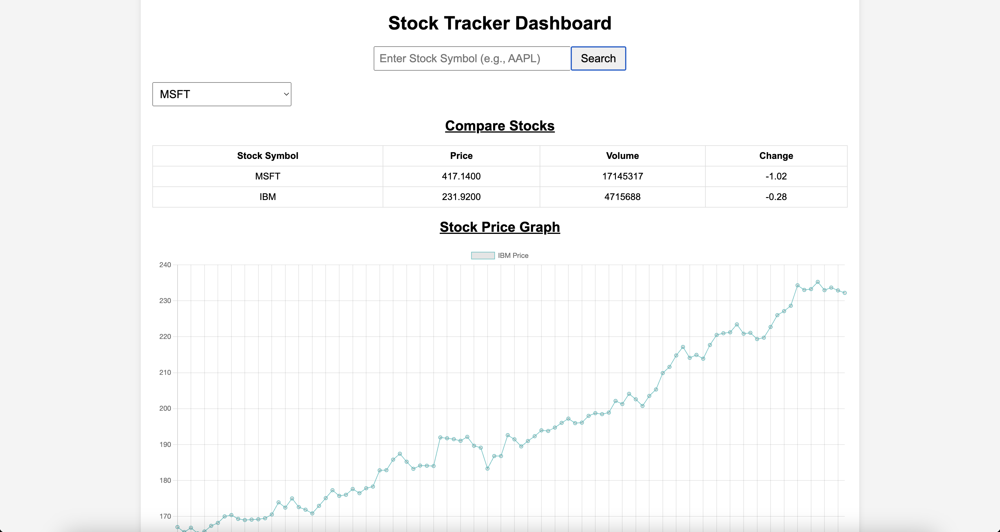
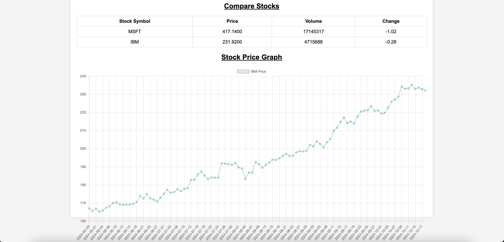

# Stock Tracker Dashboard

## Project Overview
The **Stock Tracker Dashboard** is a responsive web application designed to track stock prices, compare trending stocks, and visualize stock price trends over time. The application fetches real-time stock data from the Alpha Vantage API and displays it in a user-friendly interface.

## ScreenShort
* Image-1


* Image-2


## Features
- **Search Stocks**: Users can enter a stock symbol (e.g., AAPL) to fetch and display real-time stock information, including price, volume, and price changes.
- **Trending Stocks Dropdown**: A dropdown menu lists the top 10 trending stocks. Selecting a stock from this menu will display its details and price trends.
- **Stock Comparison Table**: A table shows stock symbols, prices, volumes, and price changes for easy comparison.
- **Stock Price Trend Graph**: Visualize the price trend of a selected stock using a line graph powered by Chart.js.
- **Responsive Design**: The dashboard is fully responsive, ensuring an optimal viewing experience on different screen sizes.

## Technologies Used
- **HTML/CSS/JavaScript**: For creating the structure, styling, and functionality of the dashboard.
- **Alpha Vantage API**: For fetching real-time stock data.
- **Chart.js**: For rendering dynamic line graphs of stock price trends.
- **Responsive Design**: Built with responsive CSS to ensure usability on devices of all sizes.

## Setup Instructions

### Prerequisites
- An internet connection to fetch stock data from the Alpha Vantage API.
- A text editor or IDE for code modification.

### Installation
1. Clone the repository:
   ```bash
   git clone https://github.com/your-username/stock-tracker-dashboard.git
   cd stock-tracker-dashboard
   ```
2. Obtain an API key from Alpha Vantage.

3. Open the script.js file and replace the apiKey value with your own API key.
    ```javascript
    const apiKey = "your-api-key-here";
    ```

### Running the Application

1. Open index.html in a web browser.

2. Use the stock symbol search form to fetch data for a specific stock.

3. Select a stock from the trending stocks dropdown to see its information and price trends.

### Folder Structure

```graphql
Stock Tracker Dashboard/
│
├── index.html         # Main HTML file
├── style.css          # CSS for styling the dashboard
├── script.js          # JavaScript file for API calls and dynamic content
└── README.md          # Project documentation
```

### Usage
* Search Stock: Enter a stock symbol (e.g., AAPL, MSFT) in the search bar and click "Search" to display stock details and a price trend graph.

* Compare Stocks: Use the trending stocks dropdown to quickly compare stock prices and trends of popular companies.

### API Reference

* Alpha Vantage API: This project uses the TIME_SERIES_DAILY endpoint to fetch daily stock price data.
    * Endpoint: https://www.alphavantage.co/query
    
    * Parameters:
        * function=TIME_SERIES_DAILY
        * symbol=<STOCK_SYMBOL>
        * apikey=<YOUR_API_KEY>

### Future Enhancements

* Stock News Integration: Add a section that fetches and displays relevant news articles for selected stocks.

* Historical Data: Allow users to select a date range for more in-depth analysis of stock performance.

# License
This project is licensed under the MIT License. See the LICENSE file for details.